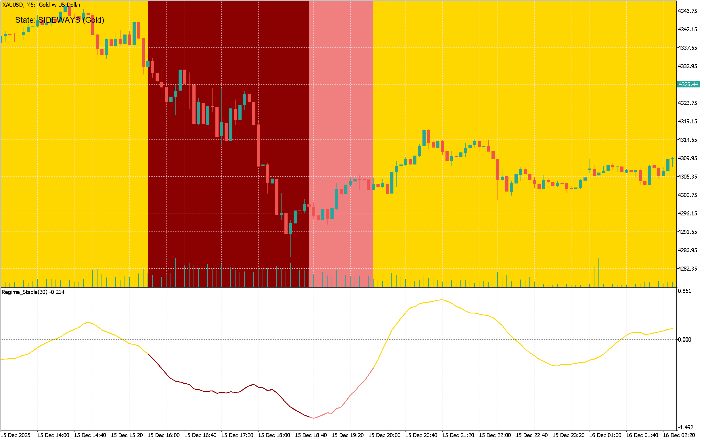
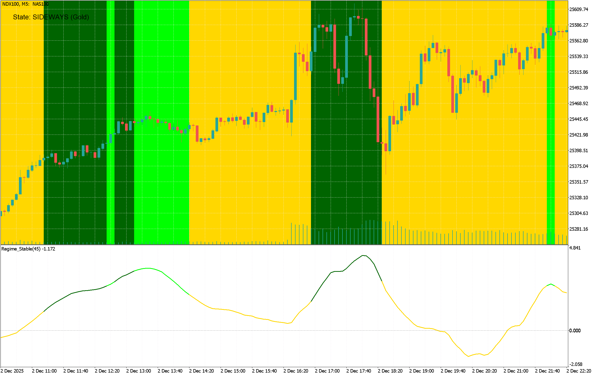
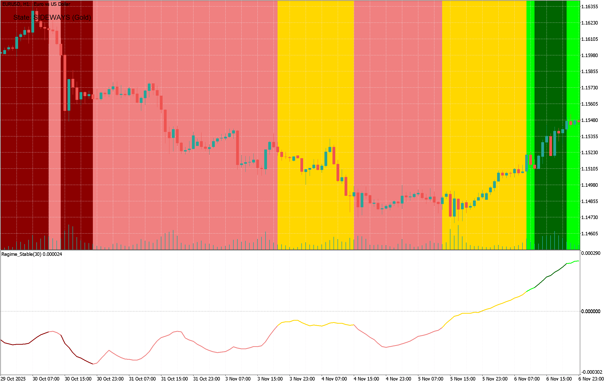

# 📊 Regime Detection Indicator (MQL5)


**An adaptive, non-repainting market classification tool for algorithmic and manual trading.**

---

## 📑 Table of Contents
- [Overview](#-overview)
- [Key Features](#-key-features)
- [Regime Matrix (How to Read)](#-regime-matrix-how-to-read)
- [Technical Logic](#-technical-logic)
- [Parameters](#-parameters)
- [Developer Integration (EA)](#-developer-integration-ea)
- [Installation](#-installation)
- [Disclaimer](#-disclaimer)

---

## 📈 Overview

The **Regime Detection Indicator** goes beyond simple overbought/oversold oscillators. It uses statistical analysis (Linear Regression Slope + Realized Volatility) to classify the market into 5 distinct "Regimes."

This allows traders to answer the most important question in trading: **"Is the market trending, crashing, or ranging?"**



<sub>*(XAUUSD, M5, 15-Dec-2025)*<sub>



<sub>*(NDX100, M5, 02-Dec-2025)*<sub>



<sub>*(EURUSD, H1, 29-Oct-2025 to 06-Nov-2025)*<sub>


---

## ✨ Key Features

* **🚫 Non-Repainting (Bar-Close Stable):** Crucial for algo-trading. The indicator "latches" its values to the previous closed bar. It **never** changes its signal or color while the current candle is forming.
* **🧠 Auto-Adaptive Thresholds:** No fixed levels (e.g., "Slope > 0.05"). Instead, it uses **Standard Deviations** and **Z-Scores**. This means it works automatically on **Forex, Crypto, Indices, and Commodities** without constant tweaking.
* **🎨 Dynamic Coloring:** The indicator line and (optionally) the main chart background change color to reflect the current regime instantly.
* **🔔 Smart Alerts:** Receive notifications (Pop-up, Sound, Log) only when the market regime significantly shifts.
* **📉 Visual Diagnostics:** Displays the active Linear Regression line directly on the price chart for the lookback period.

---

## 🧩 Regime Matrix (How to Read)

The indicator combines **Trend Direction** and **Volatility State** to output one of five regimes:

| Trend State | Volatility | **Regime Name** | **Color** | **Meaning** |
| :--- | :--- | :--- | :--- | :--- |
| **UP** | **HIGH** | **EXPLOSIVE UP** | `Dark Green` | FOMO rally, short squeeze, or parabolic move. |
| **UP** | NORMAL | **STEADY UP** | `Lime` | Healthy, sustainable trend. Best for trend-following. |
| **DOWN** | **HIGH** | **CRASH / DUMP** | `Dark Red` | Panic selling or news-driven breakdown. |
| **DOWN** | NORMAL | **SLOW BLEED** | `Light Coral` | Grinding bear market or weak correction. |
| **FLAT** | (ANY) | **SIDEWAYS** | `Gold` | Mean-reverting, ranging, or chopping. Best to stay out. |

---

## 🧮 Technical Logic

The indicator calculates two rolling metrics over a user-defined lookback window ($N$):

1.  **Trend Metric:**
    * Calculates the **Linear Regression Slope** of the price over $N$ bars.
    * Determines the **Standard Deviation** of that slope.
    * *Trigger:* If Slope > $+1.5\sigma$, it is an Uptrend. If Slope < $-1.5\sigma$, it is a Downtrend.

2.  **Volatility Metric:**
    * Calculates the standard deviation of **Logarithmic Returns** (Realized Volatility).
    * Converts this to a **Z-Score** relative to recent history.
    * *Trigger:* If Z-Score > $1.0$, Volatility is High.

---

## ⚙️ Parameters

| Parameter | Default | Description |
| :--- | :--- | :--- |
| `InpPriceType` | `PRICE_CLOSE` | Data source (Close, High, Low, Median, etc.). |
| `InpLookback` | `30` | Number of bars for the rolling window. |
| `InpTrendSensitivity`| `1.5` | Trend threshold in **Standard Deviations**. Increase to filter more noise. |
| `InpVolSensitivity` | `1.0` | Volatility threshold in **Z-Score**. |
| `InpShowPanel` | `true` | Show the status panel in the top-left corner. |
| `InpShadeBackground`| `true` | Color the chart background based on the active regime. |
| `InpShowRegLine` | `true` | Draw the black regression line on the price chart. |

---

## 💻 Developer Integration (EA)

This indicator is optimized for `iCustom` calls within Expert Advisors.

### Buffer Mapping
* **Buffer 0:** `Slope Value` (Double) - The raw regression slope.
* **Buffer 1:** `Color Index` (Int) - The regime ID.
* **Buffer 2:** `Volatility` (Double) - The realized volatility value.

### MQL5 Code Example
```cpp
// Define the handle in OnInit()
int handle = iCustom(_Symbol, _Period, "RegimeDetectionIndicator", ... inputs ...);

// Inside OnTick()
double colorBuffer[];
CopyBuffer(handle, 1, 1, 1, colorBuffer); // Copy index 1 (previous bar)

int regime = (int)colorBuffer[0];

// Color Index Map:
// 1 = EXPLOSIVE UP (DarkGreen)
// 2 = STEADY UP (Lime)
// 3 = CRASH (DarkRed)
// 4 = SLOW BLEED (LightCoral)
// 5 = SIDEWAYS (Gold)

if (regime == 5) {
   Print("Market is sideways. Pausing trend EA.");
   return;
}
```

---

## 📥 Installation

1. Download `RegimeDetectionIndicator.mq5`.
2. Open your **MetaTrader 5** terminal.
3. Go to **File** -> **Open Data Folder**.
4. Navigate to `MQL5` -> `Indicators`.
5. Paste the file into this folder.
6. Restart MT5 or right-click "Indicators" in the Navigator and hit **Refresh**.
7. Compile the file in **MetaEditor** (F7).

---

## ⚠️ Disclaimer

**Risk Warning:** Trading financial markets involves significant risk of loss. This tool is provided for educational and analytical purposes only. Past performance of any trading system or methodology is not necessarily indicative of future results. The author accepts no liability for any loss or damage, including without limitation to, any loss of profit, which may arise directly or indirectly from use of or reliance on such information.

---

**Author:** Mehrdad Shoghi  
**Copyright:** © 2025
