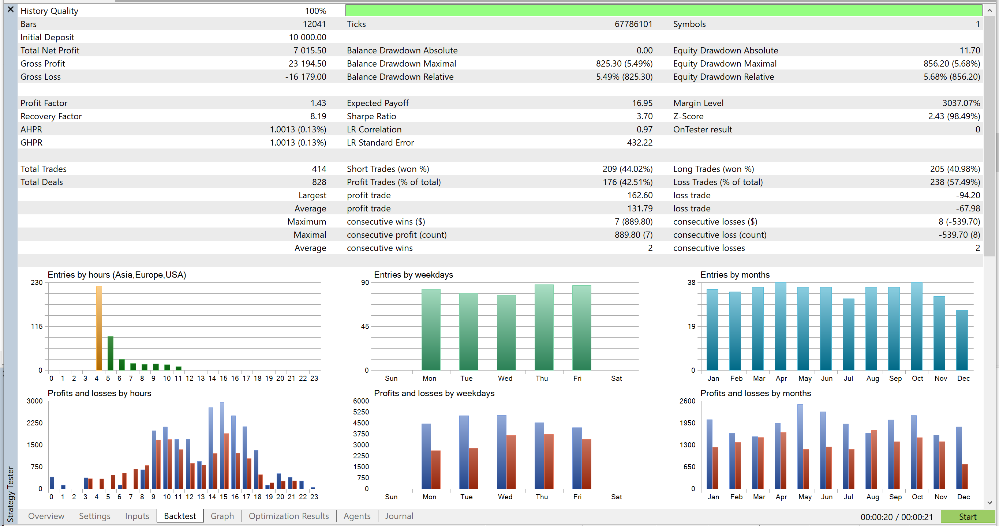
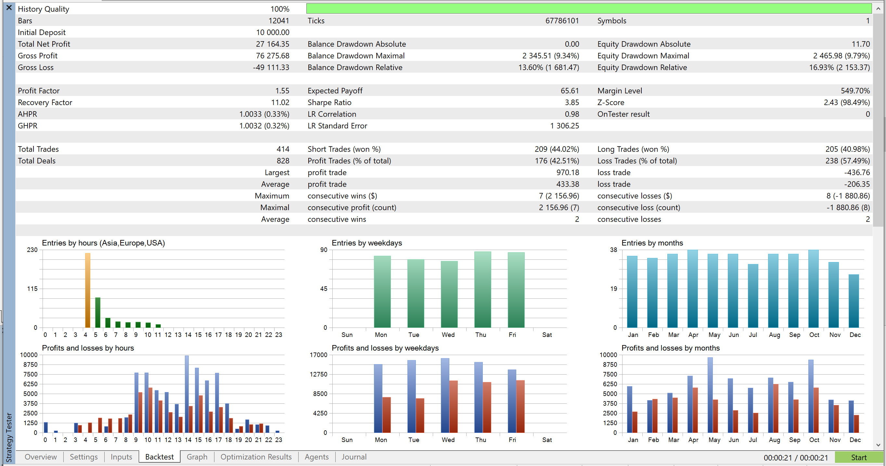

# 📈 Case Study: EURUSD-RouletteMM Performance Analysis

**An in-depth look at how the RouletteMM library transforms trading results on EURUSD.**

---

## 📑 Table of Contents
- [Executive Summary](#-executive-summary)
- [Test Conditions](#-test-conditions)
- [Comparative Analysis (Before vs. After)](#-comparative-analysis-before-vs-after)
- [Performance Metrics](#-performance-metrics)
- [Trade Analysis](#-trade-analysis)
- [Key Takeaways](#-key-takeaways)
- [Disclaimer](#-disclaimer)

---

## 🚀 Executive Summary

This case study evaluates the efficacy of the **RouletteMM** library when applied to a standard reversion strategy on **EURUSD**. By employing a **Positive Progression** money management model with **Cycle Targets** and **Flattening**, the system aims to maximize gains during winning streaks while minimizing drawdown during unfavorable market conditions.

The backtest results demonstrate a significant improvement in **Net Profit** (nearly 4x increase) and **Recovery Factor** compared to the baseline fixed-lot strategy, proving the system works even with win rates below 50%.

---

## ⚙️ Test Conditions

* **Instrument:** EURUSD
* **Timeframe:** H1 (1-Hour)
* **Period:** 2024.01.09 - 2025.12.08
* **Initial Deposit:** $10,000.00
* **Strategy Type:** Reversion Strategy

---

## 📉 Comparative Analysis (Before vs. After)

### 1. Before Money Management (Fixed Lot)
The baseline strategy yields a respectable but moderate return. With fixed lots, the growth is linear, achieving a net profit of ~$7,000 over the two-year period.

*(Backtest Graph 2024-2025: EURUSD, H1 - Before M.M.)*

### 2. After RouletteMM (Positive Progression)
With **RouletteMM** enabled, the equity curve shifts to an exponential trajectory. The system leverages "clusters" of wins to aggressively compound profits, while the "Flattening" mechanism keeps the drawdown under control relative to the massive gains.

*(Backtest Graph 2024-2025: EURUSD, H1 - With RouletteMM)*

---

## 📊 Performance Metrics

The following data is derived from the Strategy Tester report using the RouletteMM logic:

| Metric | Value | Insight |
| :--- | :--- | :--- |
| **Total Net Profit** | **$27,164.35** | Massive return on the initial $10k deposit (approx. 271% gain), compared to just 70% without MM. |
| **Profit Factor** | **1.55** | Indicates a highly robust edge, generating $1.55 for every $1 lost. |
| **Recovery Factor** | **11.02** | Exceptional recovery capability. The system recovers from drawdowns 11x faster than it creates them. |
| **Total Trades** | **414** | Statistically significant sample size over a 2-year period. |
| **Win Rate** | **42.51%** | (176 wins / 414 total). Proves that RouletteMM can generate massive profits even with a sub-50% win rate by capitalizing on R:R. |
| **Max Drawdown** | **9.79%** | ($2,465.98). Risk remains strictly controlled (under 10%) despite the aggressive compounding. |

---

## 🔍 Trade Analysis

The detailed report confirms that the strategy utilizes consecutive wins effectively.

* **Total Deals:** 828
* **Consecutive Wins:** Max of 7 ($2,156.96), validating the "Cycle" logic which likely resets after these streaks to lock in profit.
* **Time Analysis:** Trading activity is focused during specific volatile hours, optimizing entry efficiency.

*(Strategy Tester Report Summary)*

---

## 🗝️ Key Takeaways

1.  **Profit Multiplication:** The system transformed a **$7,015** profit (baseline) into **$27,164**, an improvement of nearly **400%**.
2.  **Win Rate Independence:** The strategy flourished with only a **42% win rate**, demonstrating that *how much* you win (position sizing) is often more important than *how often* you win.
3.  **High Recovery:** An outstanding Recovery Factor of **11.02** suggests the strategy is extremely resilient and spends very little time in deep drawdown.

---

## ⚠️ Disclaimer

**Risk Warning:** Past performance is not indicative of future results. The results shown here are based on historical backtesting. Trading involves significant risk of loss. Always perform your own due diligence before trading with real capital.

---

**Generated by:** Mehrdad Shoghi
**Date:** 2025
