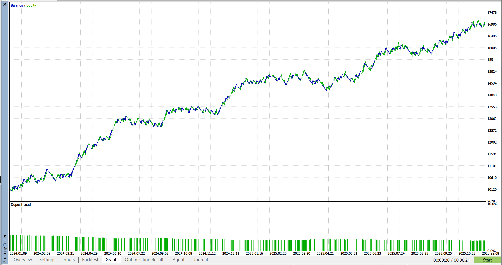
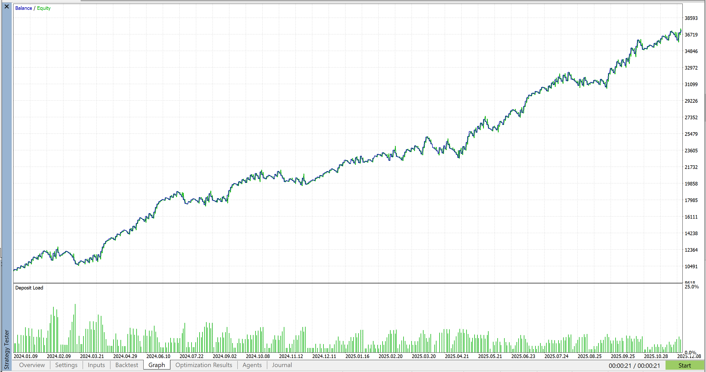

# 🎲 RouletteMM Library (MQL5)


**A modular, object-oriented Money Management engine for Expert Advisors.**

---

## 📑 Table of Contents
- [Overview](#-overview)
- [Theory & Logic](#-theory--logic)
- [Performance Comparison](#-performance-comparison)
- [Key Features](#-key-features)
- [Strategy Matrix (How to Read)](#-strategy-matrix-how-to-read)
- [Technical Logic](#-technical-logic)
- [Developer Integration](#-developer-integration)
- [Installation](#-installation)
- [Disclaimer](#-disclaimer)

---

## 📈 Overview

**RouletteMM** is a standalone C++ Class (`.mqh`) that encapsulates advanced cycle-based position sizing logic. It separates the *math* of money management from the *signals* of your trading strategy.

This allows developers to plug professional-grade "Casino Math" into any EA with just three lines of code.

---

## 📘 Theory & Logic

The **Roulette Trader** system is derived from a modified "Reverse Martingale" probability model adapted for financial markets. Unlike traditional Martingale systems that dangerously increase risk after losses (often leading to blown accounts), this logic employs a **Positive Progression** model. It scales position sizes only *after* profitable trades, capitalizing on the "clustering" nature of market trends. This approach allows the algorithm to aggressively compound equity during winning streaks while keeping the initial capital exposure static and minimal.

To solve the "giveback" problem common in progression strategies, this library implements two proprietary safeguards:
1. **Cycle Targets (Locking Profits):** This acts as a "Take Profit" for your money management. Once a specific sequence of wins is achieved (e.g., 6 units), the system forces a reset to the base lot, effectively "locking in" the compounded gains before a market reversal can reclaim them.
2. **Flattening (Defense):** This acts as a circuit breaker. Upon any loss, the system immediately reverts trade volume to a microscopic level (e.g., 0.01 lots). It remains in this "flat" state during chop or drawdowns, ensuring that losing streaks consume virtually zero capital until a new winning trend is confirmed.

---

## 📊 Performance Comparison

The following visual tests demonstrate how **RouletteMM** transforms standard strategies. By controlling drawdown during chop and compounding during trends, the equity curve is significantly improved.

### EURUSD: Trend Strategy
**Top:** Fixed Lot Size | **Bottom:** With RouletteMM (Exponential Growth)





### XAUUSD (Gold): Breakout Strategy
**Top:** Fixed Lot Size | **Bottom:** With RouletteMM (Exponential Growth)


---

## ✨ Key Features

* **🛡️ Flattening (Defensive Mode):** The system automatically drops trade size to a microscopic level (e.g., 0.01 lots) immediately after a loss. It stays flat until a win is secured, protecting the account during choppy markets.
* **💾 State Persistence:** Uses Terminal Global Variables to "remember" the cycle position. If you restart MT5 or recompile your EA, the strategy picks up exactly where it left off.
* **📦 Plug-and-Play:** Zero global variable clutter. The entire system is contained within the `CRouletteMM` class.
* **🧠 Adaptive Logic:** Supports three distinct mathematical models for different market conditions (Trending vs. Mean Reversion).

---

## 🧩 Strategy Matrix (How to Read)

The library supports three distinct modes via `ENUM_MM_TYPE`. Choose the one that fits your strategy's win rate:

| Mode | Behavior | Risk Profile | **Best For** |
| :--- | :--- | :--- | :--- |
| **MM_CONSECUTIVE** | **Positive Progression.** Resets to 1 unit immediately after *any* loss. Requires a winning streak to profit. | **Aggressive** | High Win-Rate Breakout EAs |
| **MM_CUMULATIVE** | **Balanced Progression.** After a loss, it steps down 1 unit (or less) rather than resetting fully. Retains progress during mixed results. | **Moderate** | Trend Following / Swing |
| **MM_NEGATIVE** | **Martingale Variant.** Increases risk after a loss to recover faster. Decreases risk after a win. | **High Risk** | Scalping / Mean Reversion |

---

## 🧮 Technical Logic

The engine operates on a **Cycle** principle defined by two key states:

1. **The Cycle (Offense):**
    * The system tries to complete a cycle of $N$ wins (defined by `CycleTarget`).
    * As wins accumulate, lot size increases: $Lot = Base + (Base \times Unit)$.
    * If the target is reached, the system banks the profit and resets to Unit 1.

2. **The Flattening (Defense):**
    * *Trigger:* Any loss occurs (in Positive modes).
    * *Action:* Lot size is forced to `FlatteningLot` (e.g., 0.01).
    * *Exit:* A win must occur at 0.01 to prove the market is safe. Only then does the cycle resume.

---

## 💻 Developer Integration

This library is designed for the `MQL5/Include` folder.

### 1. Initialize
```cpp
#include <RouletteMM.mqh>

// Global Instance
CRouletteMM mm;

int OnInit() {
   // Magic, Symbol, Enabled, Mode, Base, Flat, Target, UseFlat, RRR
   mm.Init(12345, _Symbol, true, MM_CONSECUTIVE, 0.1, 0.01, 6, true, 1.5);
   return(INIT_SUCCEEDED);
}
```

### 2. Get Lot Size
Call this before opening any trade:
```cpp
double lotSize = mm.GetLotSize();
trade.Buy(lotSize, ...);
```

### 3. Process Results
Call this inside `OnTradeTransaction` to update the math:
```cpp
void OnTradeTransaction(const MqlTradeTransaction& trans, ...) {
   if(trans.type == TRADE_TRANSACTION_DEAL_ADD) {
      mm.OnDeal(trans.deal);
   }
}
```

---

## 📥 Installation

1. Download `RouletteMM.mqh`.
2. Open your **MetaTrader 5** terminal.
3. Go to **File** -> **Open Data Folder**.
4. Navigate to `MQL5` -> `Include`.
5. Paste the file into this folder.
6. In your EA, add `#include <RouletteMM.mqh>` at the top.

---

## ⚠️ Disclaimer

**Risk Warning:** Trading financial markets involves significant risk of loss. This tool is provided for educational and analytical purposes only. Past performance of any trading system or methodology is not necessarily indicative of future results. The "Flattening" and "Martingale" techniques described can still result in losses if market conditions are unfavorable. The author accepts no liability for any loss or damage.

---

**Author:** Mehrdad Shoghi 
**Copyright:** © 2025
