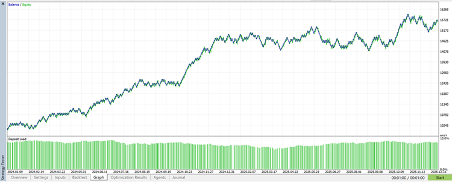
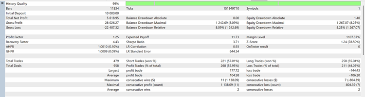
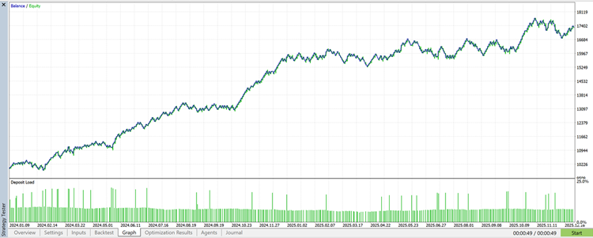
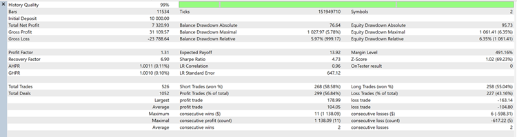

# Intraday Range Breakout with Surgical Beta-Hedging


**A volatility-aware breakout strategy utilizing "Surgical Hedging" to solve hedging drag.**

---

## 📑 Table of Contents
- [Overview](#-overview)
- [Theory & Logic](#-theory--logic)
- [Quantitative Analysis](#-quantitative-analysis)
- [Visual Performance](#-visual-performance)
- [Key Features](#-key-features)
- [Microstructure Logic](#-microstructure-logic)
- [The Surgical Filter](#-the-surgical-filter)
- [Configuration](#-configuration)
- [Disclaimer](#-disclaimer)

---

## 📈 Overview

Traders often view hedging as a necessary cost. The common belief is that hedging reduces risk but also reduces profit. This is called **"Hedging Drag."**

I wanted to solve this problem for a **Nasdaq-100 (US100)** breakout strategy. My goal was to create a **"Surgical Hedge"** using the **S&P 500 (SPX500)**. This hedge should not be active all the time. It should only activate when specific statistical conditions are met.

The results of this experiment were significant. By moving from a static hedge to a dynamic event-driven hedge, I achieved a **"Free Lunch"**:

* **Net Profit:** Increased by **30.29%**
* **Risk (Drawdown):** Decreased by **23.03%**
* **Recovery Factor:** Improved by **55.75%**

---

## 📘 Theory & Logic

The foundation of this expert advisor is a **Time-Based Volatility Breakout** system. It does not use lagging indicators like RSI or MACD. Instead, it captures the volatility injection that happens during specific market hours.

### 1. The Core Strategy
* **The Window:** At a specific server hour (e.g., 15:00), the EA begins monitoring the market.
* **The Box:** Over a set duration (e.g., 60 minutes), it builds a "High/Low Box."
* **The Trigger:** If the price breaks out of this box after the duration ends, a trade is taken.

### 2. The Innovation: Surgical Beta-Hedging
The breakout strategy provides the entries. However, the Surgical Hedge provides the stability. This is not a standard hedge. It is an **"Event-Driven"** hedge. It only activates when the correlation between Nasdaq (US100) and S&P 500 (SPX500) breaks down.

Standard hedging uses fixed lots. This is mathematically incorrect because volatility differs between assets. We calculate a **Dynamic Beta** using ATR to ensure the hedge matches the dollar volatility of the main position.

$$\beta = \frac{ATR_{main} \times VPP_{main}}{ATR_{hedge} \times VPP_{hedge}}$$

---

## 📊 Quantitative Analysis

The table below breaks down exactly how the "Surgical Hedge" improved performance metrics compared to the baseline over 11,500 bars of historical data.

| Metric | Unhedged (Baseline) | Surgical Hedge | **Value Change** | **% Impact** |
| :--- | :--- | :--- | :--- | :--- |
| **Total Net Profit** | $5,618.95 | **$7,320.93** | +$1,701.98 | **+30.29%** |
| **Max Drawdown** | 8.25% | **6.35%** | -1.90% | **-23.03%** |
| **Sharpe Ratio** | 3.71 | **4.73** | +1.02 | **+27.49%** |
| **Recovery Factor** | 4.43 | **6.90** | +2.47 | **+55.75%** |
| **Total Trades** | 479 | **526** | +47 | **+9.81%** |

### Critical Findings
1.  **The "Free Lunch" Effect:** Modern Portfolio Theory suggests that reducing risk reduces returns. This algorithm achieved the opposite. Net Profit increased by 30.29% while Equity Drawdown decreased by 23.03%.
2.  **Surgical Efficiency:** The system executed 479 baseline trades. The hedged version executed 526 trades. This means the hedge only triggered 47 times (a **9.8% activation rate**). The algorithm stays dormant 90% of the time. It only strikes during "Decoupling Events."
3.  **Resilience:** The Recovery Factor improved by 55.75% (from 4.43 to 6.90). This indicates that when the strategy takes a loss, it recovers the equity high-water mark twice as fast as the unhedged version.

---

## 📉 Visual Performance

#### 1. Baseline: Unhedged Strategy
*This is the standard breakout logic. It is profitable, but please note the deeper drawdowns in the equity curve below.*




#### 2. Optimized: Surgical Beta-Hedge Strategy
*Notice the smoother equity curve. The net profit is also significantly higher.*




---

## ✨ Key Features

* **🛡️ Event-Driven Hedging:** Only activates when correlation breaks down (Surgical).
* **💾 Microstructure Precision:** Uses M1 data for range calculation regardless of the chart timeframe.
* **🧠 Dynamic Beta Sizing:** Automatically adjusts hedge size based on volatility ratios.
* **⏱️ No Repainting:** Ranges are finalized only after the full window completes.

---

## 🔬 Microstructure Logic

A key feature of this code is how it builds the range. It uses **M1 (1-minute)** data regardless of the trading timeframe. This ensures maximum precision for the High/Low calculation. It prevents false breakouts caused by data gaps on higher timeframes.

```cpp
void BuildRangeFromM1Window() {
   // Define the start and end time of the range
   datetime rangeStart = TodayAt(RangeStartHour, RangeStartMinute);
   datetime rangeEnd   = rangeStart + RangeDurationMin * 60;

   // Use M1 data for precision
   double highs[];
   double lows[];
   int hN = CopyHigh(MainSymbol, PERIOD_M1, rangeStart, rangeEnd, highs);
   int lN = CopyLow(MainSymbol, PERIOD_M1, rangeStart, rangeEnd, lows);

   // Loop through all M1 bars to find the absolute High and Low
   double hi = -DBL_MAX;
   double lo =  DBL_MAX;
   int n = MathMin(hN, lN);
   
   for(int i=0; i<n; i++) {
      if(highs[i] > hi) hi = highs[i];
      if(lows[i]  < lo) lo = lows[i];
   }
   // Store the breakout levels
   rangeHigh = hi;
   rangeLow  = lo;
}
```

---

## 🧩 The Surgical Filter

The **`InpLagFactor` (0.30)** is the trigger threshold. It calculates the percentage return of both assets.
The logic is: *"Only open a hedge if the S&P 500 has moved less than 30% of what the Nasdaq has moved."*

* **Scenario A:** Both markets move together. We do not hedge. This saves spread costs.
* **Scenario B:** Nasdaq moves but S&P 500 stalls. This is a **"decoupling event."** We hedge immediately to protect capital.

```cpp
bool ShouldOpenHedgeFilter() {
   // Calculate % return for Main (Nasdaq) and Hedge (SPX)
   double main_ret = (main_now[0] - main_old[0]) / main_old[0];
   double hed_ret  = (hed_now[0]  - hed_old[0])  / hed_old[0];

   // 1. Direction Logic: If they are moving in opposite directions, do NOT hedge.
   if(main_ret * hed_ret < 0) return false;

   // 2. Magnitude Logic (The Surgical Filter)
   double main_abs = MathAbs(main_ret);
   double hed_abs  = MathAbs(hed_ret);

   // Trigger condition: Is the Hedge asset lagging significantly?
   return (hed_abs <= InpLagFactor * main_abs);
}
```

---

## ⚙️ Configuration

These inputs control the time window and the risk for the main trade.

```cpp
//--- Section 1: Time & Schedule
input group  "== Time & Schedule =="
input int    RangeStartHour       = 15;        // Start Hour (Server Time)
input int    RangeStartMinute     = 0;         // Start Minute
input int    RangeDurationMin     = 60;        // Duration of the "Box" in minutes
input bool   OneTradePerDay       = true;      // Limit to 1 trade to avoid over-trading

//--- Section 2: Hedging Strategy
input group  "== Hedging Strategy =="
input bool   InpEnableHedging     = true;      // Master switch
input string HedgeSymbol          = "SPX500";  // The correlated asset
input double InpLagFactor         = 0.30;      // Correlation sensitivity
```

---

## ⚠️ Disclaimer

**Risk Warning:** Trading financial markets involves significant risk of loss. This tool is provided for educational and analytical purposes only. Past performance of any trading system or methodology is not necessarily indicative of future results. The hedging techniques described increase margin utilization and require careful capital management. The author accepts no liability for any loss or damage.

---

**Author:** Mehrdad Shoghi
**Copyright:** © 2026
